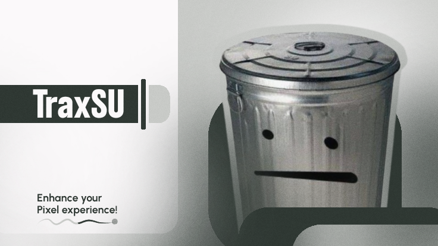

# TraxSU

  

> **Improve your UI smoothness on Pixel based ROMs**

TraxSU is a module for **Pixel-based ROMs** that optimizes your experience while adding visual changes to improve your daily drive performance in your ROM

---

## 🔑 Features
- **Google Sans Flex** font for better reading and typing
- **UI smoothness** for a great feeling when using your OS
- More to come!

---

## 🗒️ Notes
- Improved your experience on Pixel based roms with optimizations
- **Better** fonts and emojis for your eyes.
---

Enjoy your **system**, enjoy your **life**.
